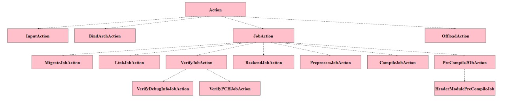

# Report

### Name: Rohith Dosawada
### Roll no: CS19B1008

---

### C++11/C++14 features used

* **final keyword** - This keyword for class, doesn't allow to derive from this class.  

  https://github.com/llvm/llvm-project/blob/main/clang/include/clang/Lex/MacroArgs.h

* **Inline** - This keyword is used to avoid function call overhead and the function is inlined.  

  https://github.com/llvm/llvm-project/blob/main/clang/include/clang/Lex/MacroInfo.h

* **Explicit** - This is used to avoid implicit conversions and have to convert explicitly.  

  https://github.com/llvm/llvm-project/blob/main/clang/include/clang/Lex/MacroInfo.h

* **Using** - It can bring a specific member from a namespace to present scope.  

  https://github.com/llvm/llvm-project/blob/main/clang/include/clang/Lex/MacroInfo.h

* **Auto** - By using this keyword, we don't need to specify the type.  

  https://github.com/llvm/llvm-project/blob/main/clang/include/clang/Lex/MacroInfo.h

* **Virtual** - This keyword is made the child classes to override the parent class' functions.  

  https://github.com/llvm/llvm-project/blob/main/clang/include/clang/Lex/ModuleLoader.h

* **Nullptr** - It is used to set a pointer to NULL.  

  https://github.com/llvm/llvm-project/blob/main/clang/include/clang/Lex/ModuleLoader.h

* **Range based loops** - This for loop executes over a range and useful to iterate over containers.  

  https://github.com/llvm/llvm-project/blob/main/clang/lib/Frontend/CompilerInvocation.cpp

* **default function** - This keyword is appended to the end of a function declaration to declare that function as an explicitly defaulted function. The Compiler itself generates the implementation, which is much efficient.  

  https://github.com/llvm/llvm-project/blob/main/clang/include/clang/Lex/DirectoryLookup.h

* **non-static data members initializers** - In Constructors we can initialize it's data members, which cleans up the code inside constructor.  

  https://github.com/llvm/llvm-project/blob/main/clang/include/clang/Lex/DirectoryLookup.h

* **variadic templates** - This can accept zero or many arguments.  

  https://github.com/llvm/llvm-project/blob/main/clang/include/clang/Lex/Token.h

* **Move** - This transfers the resources of objects and can be cast to rvalue reference.  

  https://github.com/llvm/llvm-project/blob/main/clang/include/clang/Lex/Preprocessor.h

---

### Class Hierarchy

**Reference**: https://github.com/llvm/llvm-project/blob/main/clang/include/clang/Driver/Action.h

* This Action Class is inherited by these children classes. Action class represents the steps of compilation.
* This hierarchy shows various some actions or steps performed by the compiler.

---

### OOP Design Decisions for LLVM

#### *Abstraction*

* Data members are declared private, so that they are not visible to the outside world.  
* Methods were declared here and their implementation was hidden.  

	https://github.com/llvm/llvm-project/blob/main/clang/include/clang/Lex/MacroArgs.h 

#### *Encapsulation*

* All the specific data members and information is wrapped under classes, can be observed through out the code.  

	https://github.com/llvm/llvm-project/blob/main/clang/include/clang/Frontend/TextDiagnostic.h

#### *Inheritance*

* The above class hierarchy shows the inheritance and multi level inheritance.  

	https://github.com/llvm/llvm-project/blob/main/clang/include/clang/Driver/Action.h

#### *Polymorphism*

* **Operator Overloading**:
	* Making an operator to behave as we want in different instances.

	https://github.com/llvm/llvm-project/blob/main/clang/include/clang/Lex/ModuleMap.h

* **Function Overloading**:
	* Using a single function name and perform different tasks.

	https://github.com/llvm/llvm-project/blob/main/clang/include/clang/Lex/ModuleMap.h

* **Function Overriding**:
	* Each derived class can have it's own definition of a function, which is declared in base class as virtual. And this function is being overridden by derived class. 

	https://github.com/llvm/llvm-project/blob/main/clang/include/clang/Driver/Action.h 

---

### Design Patterns

* **Observer pattern**: It's a behavioral design pattern, this allows an object to notify other objects whenever there's a change in their state.  

	https://github.com/llvm/llvm-project/blob/main/clang/include/clang/Analysis/Analyses/LiveVariables.h

---

### Usage of iterators and their own data structures

* Here, iterator class was declared as a wrapper function around int. begin, end, local_begin, local_end were implemented.  

	https://github.com/llvm/llvm-project/blob/main/clang/include/clang/Lex/PreprocessingRecord.h

* Iterators used: iterator, const_iterator, reverse_iterator, const_reverse_iterator.  

	https://github.com/llvm/llvm-project/blob/main/llvm/include/llvm/ADT/SmallVector.h

* ADTs for iterators are: Pointee_iterator, reference_proxy, iterator_adaptor_base, iterator_facade_base.  

	https://github.com/llvm/llvm-project/blob/main/llvm/include/llvm/ADT/iterator.h
  
---
